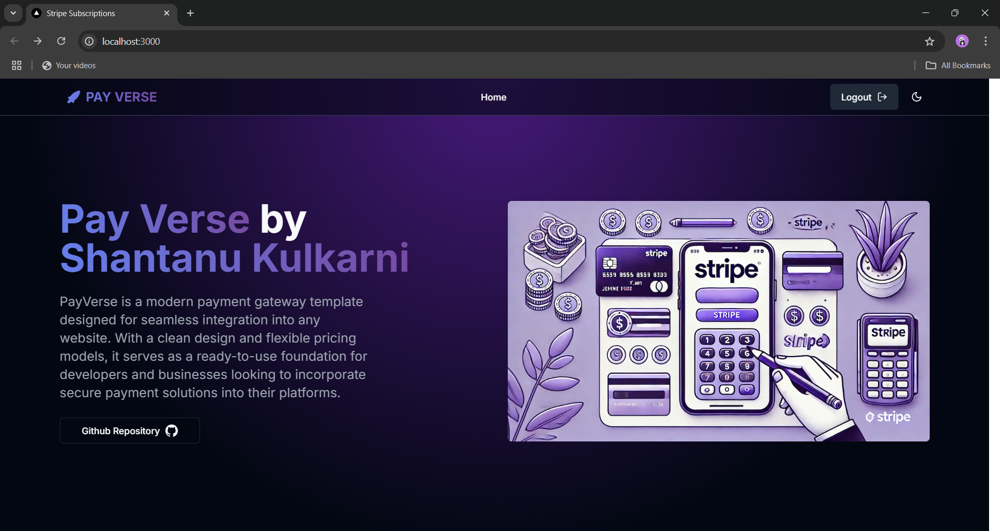

# 🌐 PayVerse - Payment Gateway Template

🚀 PayVerse is a payment gateway template built using **Stripe**, **Next.js**, **Prisma**, **Kinde Auth**, and **MongoDB**. This project helped me learn the fundamentals of Stripe payment gateways, database management with Prisma, authentication with Kinde, and modern web development with Next.js.

---

## **📚 Why I Built This Project**
I created **PayVerse** to understand how payment gateways work and to integrate Stripe into a functional web application. Through this project, I gained hands-on experience with several modern web technologies and tools.

---

## **💡 What I Learned**

### **1. 💳 Stripe Payment Integration**
- Implemented payment processing using Stripe.
- Learned about subscription models, pricing plans, and transaction management.

### **2. 🗃️ Prisma (Database ORM)**
- Integrated Prisma for database management.
- Gained insights into database schema design, querying, and migrations.

### **3. 🔐 Kinde Auth (Authentication)**
- Used Kinde for secure authentication.
- Understood user sessions, secure login, and access token management.

### **4. 📊 MongoDB**
- Chose MongoDB for storing user and payment data.
- Learned about database scaling and management.

### **5. ⚡ Next.js (Full-Stack Framework)**
- Built the entire application using Next.js.
- Explored server-side rendering, API routes, and dynamic routing.

---

## **🏗️ Project Structure**

### **💸 Pricing Plans Overview:**

1. **🎯 Free Plan**
   - Description: Ideal for startups and small projects looking to test payment integration with essential features.
   - Features: `['Basic payment processing', 'Monthly transaction limit: $500', 'Standard customer support', 'No setup fees']`

2. **💰 Premium Plan**
   - Description: Perfect for growing businesses needing advanced payment features and better transaction limits.
   - Features: `['Advanced payment processing', 'Monthly transaction limit: $5,000', 'Priority customer support', 'Customizable payment options', 'Access to analytics dashboard']`

3. **🏢 Enterprise Plan**
   - Description: Best for large enterprises requiring scalable, secure, and customized payment solutions.
   - Features: `['Unlimited transactions', 'Dedicated account manager', 'Tailored payment solutions', 'Enterprise-grade security', '24/7 technical support']`

---

## **⚙️ Technologies and Libraries Used**

### **📦 Dependencies:**
```json
{
  "@kinde-oss/kinde-auth-nextjs": "^2.4.6",
  "@prisma/client": "^6.0.1",
  "@radix-ui/react-avatar": "^1.1.0",
  "@radix-ui/react-dropdown-menu": "^2.1.1",
  "@radix-ui/react-icons": "^1.3.0",
  "@radix-ui/react-navigation-menu": "^1.2.0",
  "@radix-ui/react-slot": "^1.1.0",
  "@tanstack/react-query": "^5.62.7",
  "class-variance-authority": "^0.7.0",
  "clsx": "^2.1.1",
  "lucide-react": "^0.396.0",
  "next": "14.2.4",
  "next-themes": "^0.3.0",
  "prisma": "^5.16.0",
  "react": "^18",
  "react-dom": "^18",
  "stripe": "^16.12.0",
  "tailwind-merge": "^2.3.0",
  "tailwindcss-animate": "^1.0.7"
}
```

### **🛠️ Dev Dependencies:**
```json
{
  "@types/node": "^20",
  "@types/react": "^18",
  "@types/react-dom": "^18",
  "eslint": "^8",
  "eslint-config-next": "14.2.4",
  "postcss": "^8",
  "tailwindcss": "^3.4.1",
  "typescript": "^5"
}
```

---

## **📸 Project Screenshots**



---

## **🔑 Key Takeaways**
- Understanding of payment gateway integration.
- Full-stack development with modern frameworks and libraries.
- Enhanced skills in authentication, database management, and UI/UX development.

Building **PayVerse** was a fantastic learning experience that strengthened my web development skills and deepened my knowledge of building scalable and secure web applications. 🚀

---

**💻 Happy Coding! 💖**
